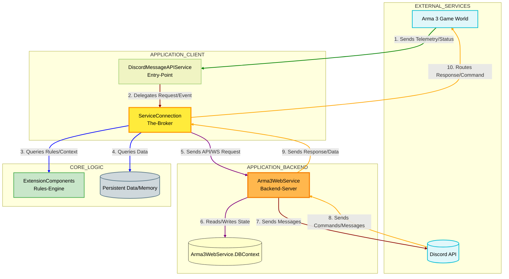

   
   
   
   

   

# What Does it do ?
A powerful and lightweight Arma 3 Extension to bridge your game server with Discord. **<ins>BattlEye Compatible ✅</ins>**

### 🚀 Key Features
- **Live Server Monitoring**: Track server status with highly customizable formats.
- **RPT Log Integration**: Real-time RPT log monitoring and retrieval via secure connections.
- **ATAK Integration**: Seamlessly send pictures/data from ATAK (Integrated with **[Better CAS Environment](https://steamcommunity.com/sharedfiles/filedetails/?id=3319624071)**).
- **Flexible Messaging**: Support for simple text, Discord Embeds, and full **_JSON_** payloads.
- **Secure & Encrypted**: Built with webhook encryption and secure service interactions.
- **Real-time Interaction**: Powered by a robust WebSocket service for low-latency communication.

## 📖 Documentation [IMPORTANT]
- 📢 Discord Server : https://discord.gg/QYCuYpDBgf
- 📃 Documentation : [Gitbook](https://aarens-base.gitbook.io/aarens-base-docs/v/aarens-discord-message-api)

# 🛠 Requirements
- Arma 3 Server must be running in **MP Mode**.
- The extension works **AFTER** the mission has started.

## Cool Projects
This project is inspired by [SQFDiscordEmbedBuilder](https://github.com/ConnorAU/SQFDiscordEmbedBuilder) by  [ConnorAU ](https://github.com/ConnorAU)

## 🧠 Architectural Description for Maintainers
### 📐System Diagram

This model reflects the roles of each component in the client-server architecture:

* **Client-Side** major components:
  *   **`Arma 3 Game World` (Source/Responder):** This component transmits telemetry and status reports about the game state to the system. It also receives commands and events initiated by the system (e.g., "Broadcast this message" or "Export `.rpt` log"). It does not initiate complex events via the Broker.
  *   **`DiscordMessageAPIService` (Entry Point):** This is the initial interface layer. It is the first component to receive unmanaged calls from the Game World via native entries (`UnmanagedCallersOnly`). It accepts the raw input and immediately delegates the processing to the Broker.
  *   **`ServiceConnection` (The Broker/Coordinator):** This is the central traffic controller. It receives events from the Game World, translates them, and coordinates the flow between the Client, the Backend, and the Rules Engine.
  *   **`ExtensionComponents` (The Rules Engine):** This framework layer contains the application's logic, data models, and service contracts. It provides the operational guidelines for how the Broker and the Backend Server should process incoming data.
  *   **`Persistent Data` (The Memory):** This stores the state and configuration data required by the Rules Engine and Backend Server to maintain consistent operation across sessions.

* **Server Backend:**
  *   **`Arma3WebService` (Backend Server):** This is the authoritative server layer. It exposes API endpoints and controllers that handle requests from the Client. It contains the core business logic, utilizes the `Arma3WebService.DBContext` for data persistence, and manages real-time communication via WebSockets.

* **External Enpoint:**
  *   **`Discord API` (External Destination):** This is the external messaging service endpoint. It is the destination for all messages sent by the Broker.

### 📝 TL;DR: System Architecture

This architecture uses a **Middleware pattern** to connect the live **Arma 3 Game World** with the external **Discord API**.

*   **Core Idea:** All communication is funneled through the **Broker/Coordinator (`ServiceConnection`)**.
*   **Execution Flow:**
    1.  The Game sends **Telemetry/Status** $\rightarrow$ **Entry Point**.
    2.  The Entry Point $\rightarrow$ **Broker**.
    3.  The Broker consults the **Rules Engine (`ExtensionComponents`)** for logic.
    4.  The Broker directs commands to the **Backend Server (`Arma3WebService`)** for execution.

**In short: The Broker acts as the traffic controller, mediating all data and command flow between the Game's Backend Server and the Discord API.**
