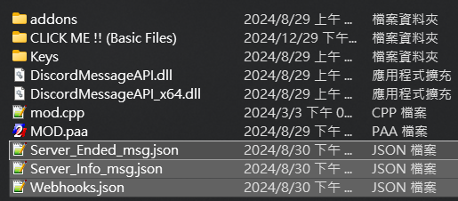

# 🔰 Quick Start


**Good to know:** A quick start guide can be good to help folks get up and running in a few steps. So you can quickly understand how to use it !



Drag all _**Basic Files**_ out :point\_down:

_(Put the them along with **DiscordMessageAPI.dll**)_



Server must under **MP** mode.

and it only works <mark style="color:yellow;">**AFTER**</mark> Mission Started.


<figure><figcaption><p>Initial State</p></figcaption></figure>

***


They should end up like below 👇


<figure><figcaption><p>Correct Result</p></figcaption></figure>

***

## Get the MOD Loaded on Server

Make sure <mark style="color:yellow;">Server</mark> load it properly in game.

## Setup Webhooks

Look into <mark style="color:yellow;">**`Aaren's Discord Message API`**</mark> mod folder should find <mark style="color:red;">**`Webhooks.json`**</mark>

_**Example :**_

```json
{
  "Webhooks": [
    "1278359253660340345/LjQUTr-KWH359tGmfiC5lCzLT0YqmH1trqYMOntkQqzMRgoff7EeIn9CRBNtxtqC0Kvr",
    "1278359253660340345/Second-Webhook"
  ]
}
```


The format \[_<mark style="color:yellow;">**`Channel-ID/Webhook-ID`**</mark>_].&#x20;

[~~https://discord.com/api/webhooks/~~](https://discord.com/api/webhooks/1278359253660340345/LjQUTr-KWH359tGmfiC5lCzLT0YqmH1trqYMOntkQqzMRgoff7EeIn9CRBNtxtqC0Kvr)  :x:

