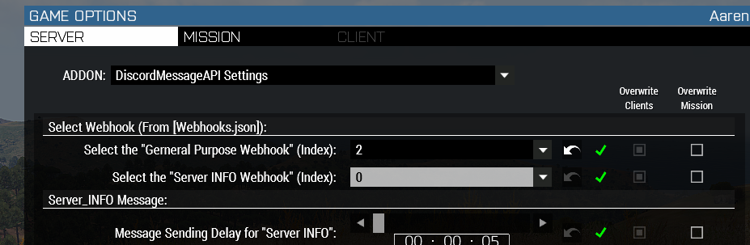

# 🖥️ Setup Server-Monit


Server must under **MP** mode.

and it only works <mark style="color:yellow;">**AFTER**</mark> Mission Started.


## Step 1 - Select Webhook

You can find the options in 👇

**`"DiscordMessageAPI Settings" >> "Select the Server INFO Webhook"`**

Select Webhook with Index.

<figure><figcaption><p>CBA Setting</p></figcaption></figure>

***

## Step 2 - Send Message via API

So we can get the **`Message ID`**

_Paste the Code below into_ [<mark style="color:orange;">**Debug Console**</mark>](https://community.bistudio.com/wiki/Arma_3:_Debug_Console) 👇


```sqf
[  
    DiscordMessageAPI_ServerWebhookSel,
    "IM SERVER INFO (COPY MY ID)"
] call DiscordAPI_fnc_sendMessage;
```



Make sure the message is sent by **the same Webhook**.

So the Webhook can edit the messge.


***

## Step 3 - **`Message ID`**

Paste the **`Message ID`** that just sent.

<figure><figcaption><p>Settings for Server INFO</p></figcaption></figure>


If the server have **Persistent** checked, the game will keep updating **Server-Status** even there's zero player in the server.


***

## Step 4 - Press _**"OK"**_&#x20;

<figure><figcaption><p>Press "OK" to Save</p></figcaption></figure>


The basic setup is done !!

Make sure everything is on the rail ,then you can go down :arrow\_down:



[customize-server-info.md](customize-server-info.md)

